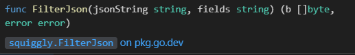

## overview
gosquiggly is adapted from https://github.com/bohnman/squiggly work as the same but only 2 level JSON property.
## how it works
to get started you need to do `go get pkg`
```
go get github.com/mariobgsp/gosquiggly
```
function will return in []bytes and an error if error occurs,


Input json with string format, here's some example with JSON 2 level
```
{
  "id": "a30fb634-0e81-45f2-a238-c3807207cd85",
  "href": "https://link.com/v2/refund/a30fb634-0e81-45f2-a238-c3807207cd85",
  "description": "Refund due to Incident #1234",
  "correlatorId": "TRXID-123456",
  "statusDate": "2020-01-08T12:06:38.230Z",
  "status": "ACCEPTED",
  "totalAmount": {
    "unit": "SGD",
    "value": 1000
  },
  "channel": {
    "id": "ChannelID"
  },
  "account": {
    "id": "7283719823145"
  },
  "paymentMethod": {
    "cardNumber": "1234567",
    "nameOnCard": "John Doe",
    "bank": "ID_BANK"
  }
}
```

input fields for filter,
```
id,href,status,totalAmount,paymentmethod.bank,paymentmethod.nameoncard,channel.id
```
##  end of words
It's only repository needed for my current project as backend developer using go. It's already achieving the requirement i need. Feel free to contribute!
